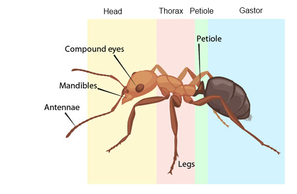

> Styles: [English](README.md), [Odia](Odia.md), [Translated](Translated.md).<br>
> [Click here to listen](https://soundcloud.com/teachersnigdha/a-new-experience).

```
I saw ants, wandering,
From time to time,
Down and up, there was a face,
Look at the water flow. ... (1)

Submerged in water, Kunduri cucumbers,
Stay tuned,
I'm going to drown, I'm worried,
I don't know what to think. ... (2)

Many times, in vain trying,
There is Bulu Thai,
I don't know what he thought.
What I did was research,
Video Karin, to the tacit trend,
I was lifting. ... (3)

In the language, I, Prakasi Deichi,
No I am a zoologist,
It's a picture that attracts attention,
I drew as a picture. ... (4)

And if anything, there is a mystery,
That's just me,
Once I saw it, I guessed,
Either false or true. ... (5)
```

- Poem by Snigdharani Sahoo
- Photo by Quang Nguyen Vinh from Pexels
